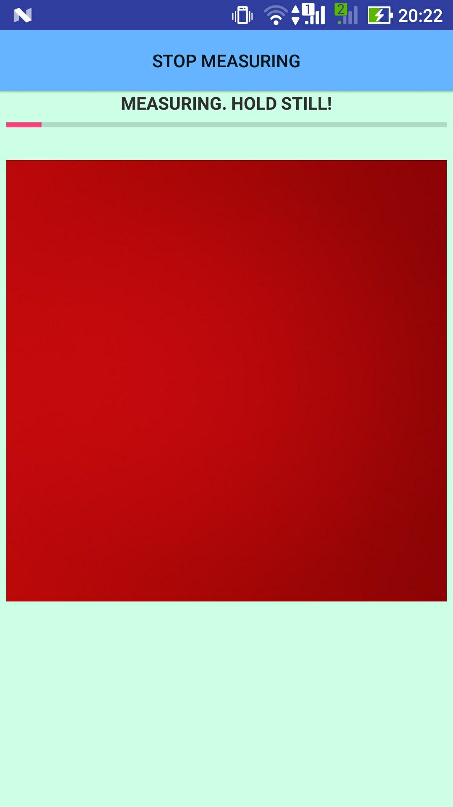

# Heart Rate Detector
### An android app for heart rate measurment using camera with flashlight

This application uses camera with flashlight to capture the image of a finger that is being held close to it, and then
extracts the red channel of RGB signal, to get a series of measurments, that is going to be interpreted like "cardiogram".
It then applies Fast Fourier Transformation to the time series to extract main frequency of the signal and it, after applying some methods directed to improve accuracy, is considered as an actual heart rate.

##### (RU) Описание
Для тестирования приложения скачайте и установите .apk файл. 
Тестируйте приложение на смартфоне с камерой и внешним светодиодом (вспышкой). 
После открытия тестовой версии приложения, вы увидите изображение с камеры и кнопку начала измерения в верхней части экрана. 
После нажатия на кнопку у вас будет 3 секунды, чтобы поставить палец к объективу камеры, если вы не сделали это заранее. Не прижимайте палец слишком сильно, но и не отодвигайте, держите так, чтобы подушечка пальца находилась в контакте с камерой, и палец был освещен светодиодом камеры. Старайтесь максимально избежать движений пальцем и рукой в целом во время измерения - это может сильно сказаться на точности. Индикаторная полоска покажет прогресс измерения. 
Вы должны увидеть что-то подобное:

После измерения вы увидите два графика. На верхнем (красном) будет показана интенсивность красного канала камеры во времени, который призван показать прилив крови к пальцу. Нижный график (синий) показывает частотный спектр сигнала, причем пик - наиболее вероятное значение пульса. При хорошем измерении пик должен быть один и ярко выражен. Также под графиками будет сообщение о том, какой пульс вычислила система, или сообщение о том, что измерение признано нечетким, и точно определить пульс не удается. 
*Замечание:* В данный момент измерение длится примерно 20 секунд, что дает шаг дискретизации равный приблизительно 3 ударам в минуту (частота сердечных сокращений определяется с такой точностью). Длительность измерения можно сократить до 10 секунд, но при этом шаг дискретизации возрастает до 6 ударов в минуту. 
**При нахождении воспроизвдимых ошибок, не медлите сообщить об этом разработчику :)** 
